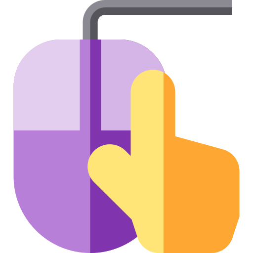

# react-context-menu

<p align="center">
  
</p>

Minimalistic provider built around native [Contextmenu Event](https://developer.mozilla.org/en-US/docs/Web/API/Element/contextmenu_event).

Unlike many similar libraries, react-context-menu simply provides a context environment, where consumer provides an actual DOM node (a reference) to an element that should trigger the menu and the component that should be rendered when the event occurs.

This makes it easy to intergrate your own UI library and show your own UI Components when a context menu is triggered. That being said, react-context-menu doesn't carry over any content or styling, nor it installs any additional dependencies.

# [CodeSandbox Demo](#TEST)

# Install

## NPM

> npm install react-context-menu

## YARN

> yarn add react-context-menu

# Props

| Props                  | Description                                                                                                                                                                                                                       | Default |
| ---------------------- | --------------------------------------------------------------------------------------------------------------------------------------------------------------------------------------------------------------------------------- | ------- |
| trigger                | A react reference to an element that will trigger the menu on right click                                                                                                                                                         | null    |
| component              | A component to show when trigger is right clicked                                                                                                                                                                                 | null    |
| isOpenAfterInteraction | Determines if a menu should remain open after user interacts with it. For instance, maybe you will render a list of checkboxes that user has to interact with, and you don't want menu to close it after each interaction (click) | true    |
| className              | A custom className in case you want to apply custom styling to the context wrapper                                                                                                                                                | null    |

# Use

```js
import React, { useRef } from "react";
import ContextMenu from "react-context-menu";

export const ExampleComponent = () => {
  const ref = useRef();
  return (
    <>
      <ContextMenu
        isOpenAfterInteraction={false}
        trigger={ref}
        component={<SomeUiComponent />}
      />
      <div className="foo" ref={ref}>
        Once someone clicks inside of me, I will trigger some content!
      </div>
    </>
  );
};
```

# Transitions

## Example using [react-motion](https://github.com/chenglou/react-motion)

To keep the minimal footprint, react-context-menu doesn't apply any transitions to the component triggered. This decision was made in order to keep minimal amount of external dependencies and to allow a consumer to add them.

In the showcase below, we can see how we used a [render-prop](https://reactpatterns.com/#render-prop) from react-motion to generate some styles and pass them down to the ContextMenu.

```js
import React, { useRef, useState } from "react";
import { Motion, spring } from "react-motion";
import ContextMenu from "./index";

export const ExampleComponent = () => {
  const [isMenuShown, setIsMenuShown] = useState(false);
  const ref = useRef();
  return (
    <>
      <Motion
        defaultStyle={{ opacity: 0 }}
        style={{
          opacity: !isMenuShown ? spring(0) : spring(1),
        }}
      >
        {(interpolatedStyle) => {
          return (
            <ContextMenu
              trigger={ref}
              component={<Foo />}
              isOpen={isMenuShown}
              setIsOpen={setIsMenuShown}
              style={{ opacity: interpolatedStyle.opacity }}
            />
          );
        }}
      </Motion>
      <div ref={ref} style={customStyles}>
        Right click inside of me!
      </div>
    </>
  );
};
```
